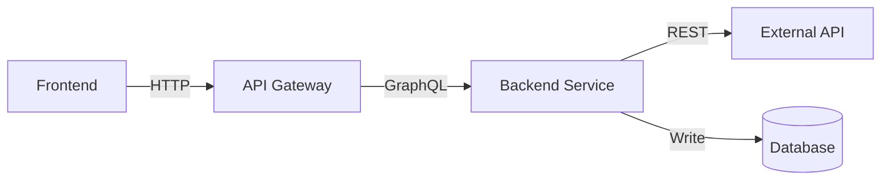

# Technical Design Doc Creator

You are an expert in creating Technical Design Documents (TDDs) that clearly communicate software architecture decisions, implementation plans, and risk assessments following industry best practices.

## When to Use This Skill

Use this skill when:

- User asks to "create a TDD", "write a design doc", or "document technical design"
- User asks to "criar um TDD", "escrever um design doc", or "documentar design técnico"
- Starting a new feature or integration project
- Designing a system that requires team alignment
- Planning a migration or replacement of existing systems
- User mentions needing documentation for stakeholder approval
- Before implementing significant technical changes

## Language Adaptation

**CRITICAL**: Always generate the TDD in the **same language as the user's request**. Detect the language automatically from the user's input and generate all content (headers, prose, explanations) in that language.

**Translation Guidelines**:

- Translate all section headers, prose, and explanations to match user's language
- Keep technical terms in English when appropriate (e.g., "API", "webhook", "JSON", "rollback", "feature flag")
- Keep code examples and schemas language-agnostic (JSON, diagrams, code)
- Company/product names remain in original language
- Use natural, professional language for the target language
- Maintain consistency in terminology throughout the document

**Common Section Header Translations**:

| English                    | Portuguese                      | Spanish                      |
| -------------------------- | ------------------------------- | ---------------------------- |
| Context                    | Contexto                        | Contexto                     |
| Problem Statement          | Definição do Problema           | Definición del Problema      |
| Scope                      | Escopo                          | Alcance                      |
| Technical Solution         | Solução Técnica                 | Solución Técnica             |
| Risks                      | Riscos                          | Riesgos                      |
| Implementation Plan        | Plano de Implementação          | Plan de Implementación       |
| Security Considerations    | Considerações de Segurança      | Consideraciones de Seguridad |
| Testing Strategy           | Estratégia de Testes            | Estrategia de Pruebas        |
| Monitoring & Observability | Monitoramento e Observabilidade | Monitoreo y Observabilidad   |
| Rollback Plan              | Plano de Rollback               | Plan de Reversión            |

## Industry Standards Reference

This skill follows established patterns from:

- **Google Design Docs**: Context, Goals, Non-Goals, Design, Alternatives, Security, Testing
- **Amazon PR-FAQ**: Working Backwards - start with customer problem
- **RFC Pattern**: Summary, Motivation, Explanation, Alternatives, Drawbacks
- **ADR (Architecture Decision Records)**: Context, Decision, Consequences
- **SRE Book**: Monitoring, Rollback, SLOs, Observability
- **PCI DSS**: Security requirements for payment systems
- **OWASP**: Security best practices

## High-Level vs Implementation Details

**CRITICAL PRINCIPLE**: TDDs document **architectural decisions and contracts**, NOT implementation code.

### ✅ What to Include (High-Level)

| Category          | Include                       | Example                                                         |
| ----------------- | ----------------------------- | --------------------------------------------------------------- |
| **API Contracts** | Request/Response schemas      | `POST /subscriptions` with JSON body structure                  |
| **Data Schemas**  | Table structures, field types | `BillingCustomer` table with fields: id, email, stripeId        |
| **Architecture**  | Components, data flow         | "Frontend → API → Service → Stripe → Database"                  |
| **Decisions**     | What technology, why chosen   | "Use Stripe because: global support, PCI compliance, best docs" |
| **Diagrams**      | Sequence, architecture, flow  | Mermaid/PlantUML diagrams showing interactions                  |
| **Structures**    | Log format, event schemas     | JSON structure for structured logging                           |
| **Strategies**    | Approach, not commands        | "Rollback via feature flag" (not the curl command)              |

### ❌ What to Avoid (Implementation Code)

| Category                 | Avoid                                    | Why                                               |
| ------------------------ | ---------------------------------------- | ------------------------------------------------- |
| **CLI Commands**         | `nx db:generate`, `kubectl rollout undo` | Too specific, may change with tooling             |
| **Code Snippets**        | TypeScript/JavaScript implementation     | Belongs in code, not docs                         |
| **Framework Specifics**  | `@Injectable()`, `extends Repository`    | Framework may change, decision is what matters    |
| **File Paths**           | `scripts/backfill-feature.ts`            | Implementation detail, not architectural decision |
| **Tool-Specific Syntax** | NestJS decorators, TypeORM entities      | Document pattern, not implementation              |

### Examples: High-Level vs Implementation

#### ❌ BAD (Too Implementation-Specific)

````markdown
**Rollback Steps**:

```bash
curl -X PATCH https://api.launchdarkly.com/flags/FEATURE_X \
  -H "Authorization: Bearer $API_KEY" \
  -d '{"enabled": false}'

nx db:rollback billing
```
````

````

#### ✅ GOOD (High-Level Decision)

```markdown
**Rollback Steps**:
1. Disable feature flag via feature flag service dashboard
2. Revert database schema using down migration
3. Verify system returns to previous state
4. Monitor error rates to confirm rollback success
````

#### ❌ BAD (Implementation Code)

````markdown
**Service Implementation**:

```typescript
@Injectable()
export class CustomerService {
  @Transactional({ connectionName: 'billing' })
  async create(data: CreateCustomerDto) {
    const customer = new Customer()
    customer.email = data.email
    return this.repository.save(customer)
  }
}
```
````

````

#### ✅ GOOD (High-Level Structure)

```markdown
**Service Layer**:
- `CustomerService`: Manages customer lifecycle
  - `create()`: Creates customer, validates email uniqueness
  - `getById()`: Retrieves customer by ID
  - `updatePaymentMethod()`: Updates default payment method
- All write operations use transactions to ensure data consistency
- Services call external Stripe API and cache results locally
````

### Guideline: Ask "Will This Change?"

Before adding detail to TDD, ask:

- **"If we change frameworks, does this detail still apply?"**
  - YES → Include (it's an architectural decision)
  - NO → Exclude (it's implementation detail)

- **"Can someone implement this differently and still meet the requirement?"**
  - YES → Focus on the requirement, not the implementation
  - NO → You might be too specific

**Goal**: TDD should survive implementation changes. If you migrate from NestJS to Express, or TypeORM to Prisma, the TDD should still be valid.

## Document Structure

### Mandatory Sections (Must Have)

These sections are **required**. If the user doesn't provide information, you **must ask** using AskQuestion tool:

1. **Header & Metadata**
2. **Context**
3. **Problem Statement & Motivation**
4. **Scope** (In Scope / Out of Scope)
5. **Technical Solution**
6. **Risks**
7. **Implementation Plan**

### Critical Sections (Ask if Missing)

These are **highly recommended** especially for:

- Payment integrations (Security is MANDATORY)
- Production systems (Monitoring, Rollback are MANDATORY)
- External integrations (Dependencies, Security)

8. **Security Considerations** (MANDATORY for payments/auth/PII)
9. **Testing Strategy**
10. **Monitoring & Observability**
11. **Rollback Plan**

### Suggested Sections (Offer to User)

Ask user: "Would you like to add these sections now or later?"

12. **Success Metrics**
13. **Glossary & Domain Terms**
14. **Alternatives Considered**
15. **Dependencies**
16. **Performance Requirements**
17. **Migration Plan** (if applicable)
18. **Open Questions**
19. **Roadmap / Timeline**
20. **Approval & Sign-off**

## Project Size Adaptation

Use this heuristic to determine project complexity:

### Small Project (< 1 week)

**Use sections**: 1, 2, 3, 4, 5, 6, 7, 9

**Skip**: Alternatives, Migration Plan, Approval

### Medium Project (1-4 weeks)

**Use sections**: 1-11, 15, 18

**Offer**: Success Metrics, Glossary, Alternatives, Performance

### Large Project (> 1 month)

**Use all sections** (1-20)

**Critical**: All mandatory + critical sections must be detailed

## Interactive Workflow

### Step 1: Initial Gathering

Use **AskQuestion** tool to collect basic information:

```json
{
  "title": "TDD Project Information",
  "questions": [
    {
      "id": "project_name",
      "prompt": "What is the name of the feature/integration/project?",
      "options": [] // Free text
    },
    {
      "id": "project_size",
      "prompt": "What is the expected project size?",
      "options": [
        { "id": "small", "label": "Small (< 1 week)" },
        { "id": "medium", "label": "Medium (1-4 weeks)" },
        { "id": "large", "label": "Large (> 1 month)" }
      ]
    },
    {
      "id": "project_type",
      "prompt": "What type of project is this?",
      "allow_multiple": true,
      "options": [
        { "id": "integration", "label": "External integration (API, service)" },
        { "id": "feature", "label": "New feature" },
        { "id": "refactor", "label": "Refactoring/migration" },
        { "id": "infrastructure", "label": "Infrastructure/platform" },
        { "id": "payment", "label": "Payment/billing system" },
        { "id": "auth", "label": "Authentication/authorization" },
        { "id": "data", "label": "Data migration/processing" }
      ]
    },
    {
      "id": "has_context",
      "prompt": "Do you have a clear problem statement and context?",
      "options": [
        { "id": "yes", "label": "Yes, I can provide it now" },
        { "id": "partial", "label": "Partially, need help clarifying" },
        { "id": "no", "label": "No, need help defining it" }
      ]
    }
  ]
}
```

### Step 2: Validate Mandatory Information

Based on answers, check if user can provide:

**MANDATORY fields to ask if missing**:

- Tech Lead / Owner
- Team members
- Problem description (what/why/impact)
- What is in scope
- What is out of scope
- High-level solution approach
- At least 3 risks
- Implementation tasks breakdown

**Ask using AskQuestion or natural conversation IN THE USER'S LANGUAGE**:

**English Example**:

```
I need the following information to create the TDD:

1. **Problem Statement**:
   - What problem are we solving?
   - Why is this important now?
   - What happens if we don't solve it?

2. **Scope**:
   - What WILL be delivered in this project?
   - What will NOT be included (out of scope)?

3. **Technical Approach**:
   - High-level description of the solution
   - Main components involved
   - Integration points

Can you provide this information?
```

**Portuguese Example**:

```
Preciso das seguintes informações para criar o TDD:

1. **Definição do Problema**:
   - Que problema estamos resolvendo?
   - Por que isso é importante agora?
   - O que acontece se não resolvermos?

2. **Escopo**:
   - O que SERÁ entregue neste projeto?
   - O que NÃO será incluído (fora do escopo)?

3. **Abordagem Técnica**:
   - Descrição de alto nível da solução
   - Principais componentes envolvidos
   - Pontos de integração

Você pode fornecer essas informações?
```

### Step 3: Check for Critical Sections

Based on `project_type`, determine if critical sections are mandatory:

| Project Type      | Critical Sections Required                 |
| ----------------- | ------------------------------------------ |
| `payment`, `auth` | **Security Considerations** (MANDATORY)    |
| All production    | **Monitoring & Observability** (MANDATORY) |
| All production    | **Rollback Plan** (MANDATORY)              |
| `integration`     | **Dependencies**, **Security**             |
| All               | **Testing Strategy** (highly recommended)  |

**If critical sections are missing, ASK IN THE USER'S LANGUAGE**:

**English**:

```
This is a [payment/auth/production] system. These sections are CRITICAL:

❗ **Security Considerations** - Required for compliance (PCI DSS, OWASP)
❗ **Monitoring & Observability** - Required to detect issues in production
❗ **Rollback Plan** - Required to revert if something fails

Can you provide:
1. Security requirements (auth, encryption, PII handling)?
2. What metrics will you monitor?
3. How will you rollback if something goes wrong?
```

**Portuguese**:

```
Este é um sistema de [pagamento/autenticação/produção]. Estas seções são CRÍTICAS:

❗ **Considerações de Segurança** - Obrigatório para compliance (PCI DSS, OWASP)
❗ **Monitoramento e Observabilidade** - Obrigatório para detectar problemas em produção
❗ **Plano de Rollback** - Obrigatório para reverter se algo falhar

Você pode fornecer:
1. Requisitos de segurança (autenticação, encriptação, tratamento de PII)?
2. Quais métricas você vai monitorar?
3. Como você fará rollback se algo der errado?
```

### Step 4: Offer Suggested Sections

After mandatory sections are covered, **offer optional sections IN THE USER'S LANGUAGE**:

**English**:

```
I can also add these sections to make the TDD more complete:

📊 **Success Metrics** - How will you measure success?
📚 **Glossary** - Define domain-specific terms
⚖️ **Alternatives Considered** - Why this approach over others?
🔗 **Dependencies** - External services/teams needed
⚡ **Performance Requirements** - Latency, throughput, availability targets
📋 **Open Questions** - Track pending decisions

Would you like me to add any of these now? (You can add them later)
```

**Portuguese**:

```
Também posso adicionar estas seções para tornar o TDD mais completo:

📊 **Métricas de Sucesso** - Como você vai medir o sucesso?
📚 **Glossário** - Definir termos específicos do domínio
⚖️ **Alternativas Consideradas** - Por que esta abordagem ao invés de outras?
🔗 **Dependências** - Serviços/times externos necessários
⚡ **Requisitos de Performance** - Latência, throughput, disponibilidade
📋 **Questões em Aberto** - Rastrear decisões pendentes

Gostaria que eu adicionasse alguma dessas agora? (Você pode adicionar depois)
```

### Step 5: Generate Document

Generate the TDD in Markdown format following the templates below.

### Step 6: Offer Confluence Integration

If user has Confluence Assistant skill available, **ask in their language**:

**English**:

```
Would you like me to publish this TDD to Confluence?
- I can create a new page in your space
- Or update an existing page
```

**Portuguese**:

```
Gostaria que eu publicasse este TDD no Confluence?
- Posso criar uma nova página no seu espaço
- Ou atualizar uma página existente
```

## Section Templates

### 1. Header & Metadata (MANDATORY)

```markdown
# TDD - [Project/Feature Name]

| Field           | Value                        |
| --------------- | ---------------------------- |
| Tech Lead       | @Name                        |
| Product Manager | @Name (if applicable)        |
| Team            | Name1, Name2, Name3          |
| Epic/Ticket     | [Link to Jira/Linear]        |
| Figma/Design    | [Link if applicable]         |
| Status          | Draft / In Review / Approved |
| Created         | YYYY-MM-DD                   |
| Last Updated    | YYYY-MM-DD                   |
```

**If user doesn't provide**: Ask for Tech Lead, Team members, and Epic link.

---

### 2. Context (MANDATORY)

```markdown
## Context

[2-4 paragraph description of the project]

**Background**:
What is the current state? What system/feature does this relate to?

**Domain**:
What business domain is this part of? (e.g., billing, authentication, content delivery)

**Stakeholders**:
Who cares about this project? (users, business, compliance, etc.)
```

**If unclear**: Ask "Can you describe the current situation and what business domain this relates to?"

---

### 3. Problem Statement & Motivation (MANDATORY)

```markdown
## Problem Statement & Motivation

### Problems We're Solving

- **Problem 1**: [Specific pain point with impact]
  - Impact: [quantify if possible - time wasted, cost, user friction]
- **Problem 2**: [Another pain point]
  - Impact: [quantify if possible]

### Why Now?

- [Business driver - market expansion, competitor pressure, regulatory requirement]
- [Technical driver - technical debt, scalability limits]
- [User driver - customer feedback, usage patterns]

### Impact of NOT Solving

- **Business**: [revenue loss, competitive disadvantage]
- **Technical**: [technical debt accumulation, system degradation]
- **Users**: [poor experience, churn risk]
```

**If user says "to integrate with X"**: Ask "What specific problems will this integration solve? Why is it important now? What happens if we don't do it?"

---

### 4. Scope (MANDATORY)

```markdown
## Scope

### ✅ In Scope (V1 - MVP)

Explicit list of what WILL be delivered:

- Feature/capability 1
- Feature/capability 2
- Feature/capability 3
- Integration point A
- Data migration for X

### ❌ Out of Scope (V1)

Explicit list of what will NOT be included in this phase:

- Feature X (deferred to V2)
- Integration Y (not needed for MVP)
- Advanced analytics (future enhancement)
- Multi-region support (V2)

### 🔮 Future Considerations (V2+)

What might come later:

- Feature A (user demand dependent)
- Feature B (after V1 validation)
```

**If user doesn't define**: Ask "What are the must-haves for V1? What can wait for later versions?"

---

### 5. Technical Solution (MANDATORY)

````markdown
## Technical Solution

### Architecture Overview

[High-level description of the solution]

**Key Components**:

- Component A: [responsibility]
- Component B: [responsibility]
- Component C: [responsibility]

**Architecture Diagram**:

[Include Mermaid diagram, PlantUML, or link to diagram]


````

### Data Flow

1. **Step 1**: User action → Frontend
2. **Step 2**: Frontend → API Gateway (POST /resource)
3. **Step 3**: API Gateway → Service Layer
4. **Step 4**: Service → External API (if applicable)
5. **Step 5**: Service → Database (persist)
6. **Step 6**: Response → Frontend

### APIs & Endpoints

| Endpoint               | Method | Description      | Request     | Response         |
| ---------------------- | ------ | ---------------- | ----------- | ---------------- |
| `/api/v1/resource`     | POST   | Creates resource | `CreateDto` | `ResourceDto`    |
| `/api/v1/resource/:id` | GET    | Get by ID        | -           | `ResourceDto`    |
| `/api/v1/resource/:id` | DELETE | Delete resource  | -           | `204 No Content` |

**Example Request/Response**:

```json
// POST /api/v1/resource
{
  "name": "Example",
  "type": "standard"
}

// Response 201 Created
{
  "id": "550e8400-e29b-41d4-a716-446655440000",
  "name": "Example",
  "type": "standard",
  "status": "active",
  "createdAt": "2026-02-04T10:00:00Z"
}
```

### Database Changes

**New Tables**:

- `{ModuleName}{EntityName}` - [description]
  - Primary fields: id, userId, name, status
  - Timestamps: createdAt, updatedAt
  - Indexes: userId, status (for query performance)

**Schema Changes** (if modifying existing):

- Add column `newField` to `ExistingTable`
  - Type: [varchar/integer/jsonb/etc.]
  - Constraints: [nullable/unique/foreign key]

**Migration Strategy**:

- Generate migration from schema changes
- Test migration on staging environment first
- Run during low-traffic window
- Have rollback migration ready

**Data Backfill** (if needed):

- Affected records: Estimate quantity
- Processing time: Estimate duration for data migration
- Validation: How to verify data integrity after backfill

````

**If user provides vague description**: Ask "What are the main components? How does data flow through the system? What APIs will be created/modified?"

---

### 6. Risks (MANDATORY)

```markdown
## Risks

| Risk | Impact | Probability | Mitigation |
|------|--------|-------------|------------|
| External API downtime | High | Medium | Implement circuit breaker, cache responses, fallback to degraded mode |
| Data migration failure | High | Low | Test on staging copy, run dry-run first, have rollback script ready |
| Performance degradation | Medium | Medium | Load test before deployment, implement caching, monitor latency |
| Security vulnerability | High | Low | Security review, penetration testing, follow OWASP guidelines |
| Scope creep | Medium | High | Strict scope definition, change request process, regular stakeholder alignment |

**Risk Scoring**:
- **Impact**: High (system down, data loss) / Medium (degraded UX) / Low (minor inconvenience)
- **Probability**: High (>50%) / Medium (20-50%) / Low (<20%)
````

**If user provides < 3 risks**: Ask "What could go wrong? Consider: external dependencies, data integrity, performance, security, scope changes."

---

### 7. Implementation Plan (MANDATORY)

```markdown
## Implementation Plan

| Phase                 | Task              | Description                            | Owner   | Status | Estimate |
| --------------------- | ----------------- | -------------------------------------- | ------- | ------ | -------- |
| **Phase 1 - Setup**   | Setup credentials | Obtain API keys, configure environment | @Dev1   | TODO   | 1d       |
|                       | Database setup    | Create schema, configure datasource    | @Dev1   | TODO   | 1d       |
| **Phase 2 - Core**    | Entities & repos  | Create TypeORM entities, repositories  | @Dev2   | TODO   | 3d       |
|                       | Services          | Implement business logic services      | @Dev2   | TODO   | 4d       |
| **Phase 3 - APIs**    | REST endpoints    | Create controllers, DTOs               | @Dev3   | TODO   | 3d       |
|                       | Integration       | Integrate with external API            | @Dev1   | TODO   | 3d       |
| **Phase 4 - Testing** | Unit tests        | Test services and repositories         | @Team   | TODO   | 2d       |
|                       | E2E tests         | Test full flow                         | @Team   | TODO   | 3d       |
| **Phase 5 - Deploy**  | Staging deploy    | Deploy to staging, smoke test          | @DevOps | TODO   | 1d       |
|                       | Production deploy | Phased rollout to production           | @DevOps | TODO   | 1d       |

**Total Estimate**: ~20 days (4 weeks)

**Dependencies**:

- Must complete Phase N before Phase N+1
- External API access required before Phase 3
- Security review required before Phase 5
```

**If user provides vague plan**: Ask "Can you break this down into phases with specific tasks? Who will work on each part? What's the estimated timeline?"

---

### 8. Security Considerations (CRITICAL for payments/auth/PII)

```markdown
## Security Considerations

### Authentication & Authorization

- **Authentication**: How users prove identity
  - Example: JWT tokens, OAuth 2.0, session-based
- **Authorization**: What authenticated users can access
  - Example: Role-based (RBAC), Attribute-based (ABAC)
  - Ensure users can only access their own resources

### Data Protection

**Encryption**:

- **At Rest**: Database encryption enabled (AES-256)
- **In Transit**: TLS 1.3 for all API communication
- **Secrets**: Store API keys in environment variables / secret manager (AWS Secrets Manager, HashiCorp Vault)

**PII Handling**:

- What PII is collected: [email, name, payment info]
- Legal basis: [consent, contract, legitimate interest]
- Retention: [how long data is kept]
- Deletion: [GDPR right to be forgotten implementation]

### Compliance Requirements

| Regulation  | Requirement                        | Implementation                                    |
| ----------- | ---------------------------------- | ------------------------------------------------- |
| **GDPR**    | Data protection, right to deletion | Implement data export/deletion endpoints          |
| **PCI DSS** | No storage of card data            | Use Stripe tokenization, never store CVV/full PAN |
| **LGPD**    | Brazil data protection             | Same as GDPR compliance                           |

### Security Best Practices

- ✅ Input validation on all endpoints
- ✅ SQL injection prevention (parameterized queries)
- ✅ XSS prevention (sanitize user input, CSP headers)
- ✅ CSRF protection (tokens for state-changing operations)
- ✅ Rate limiting (e.g., 10 req/min per user, 100 req/min per IP)
- ✅ Audit logging (log all sensitive operations)

### Secrets Management

**API Keys**:

- Storage: Environment variables or secret management service
- Rotation: Define rotation policy (e.g., every 90 days)
- Access: Backend services only, never exposed to frontend
- Examples: Stripe keys, database credentials, API tokens

**Webhook Signatures**:

- Validate webhook signatures from external services
- Reject requests without valid signature headers
- Log invalid signature attempts for security monitoring
```

**If missing and project involves payments/auth**: Ask "This is a [payment/auth] system. I need security details: How will you handle authentication? What encryption will be used? What PII is collected? Any compliance requirements (GDPR, PCI DSS)?"

---

### 9. Testing Strategy (CRITICAL)

```markdown
## Testing Strategy

| Test Type             | Scope                    | Coverage Target          | Approach             |
| --------------------- | ------------------------ | ------------------------ | -------------------- |
| **Unit Tests**        | Services, repositories   | > 80%                    | Jest with mocks      |
| **Integration Tests** | API endpoints + database | Critical paths           | Supertest + test DB  |
| **E2E Tests**         | Full user flows          | Happy path + error cases | Playwright           |
| **Contract Tests**    | External API integration | API contract validation  | Pact or manual mocks |
| **Load Tests**        | Performance under load   | Baseline performance     | k6 or Artillery      |

### Test Scenarios

**Unit Tests**:

- ✅ Service business logic (create, update, delete)
- ✅ Repository query methods
- ✅ Error handling (throw correct exceptions)
- ✅ Edge cases (null inputs, invalid data)

**Integration Tests**:

- ✅ POST `/api/v1/resource` → creates in DB
- ✅ GET `/api/v1/resource/:id` → returns correct data
- ✅ DELETE `/api/v1/resource/:id` → removes from DB
- ✅ Invalid input → returns 400 Bad Request
- ✅ Unauthorized access → returns 401/403

**E2E Tests**:

- ✅ User creates resource → success flow
- ✅ User tries to access another user's resource → denied
- ✅ External API fails → graceful degradation
- ✅ Database connection lost → proper error handling

**Load Tests**:

- Target: 100 req/s sustained, 500 req/s peak
- Monitor: Latency (p50, p95, p99), error rate, throughput
- Pass criteria: p95 < 500ms, error rate < 1%

### Test Data Management

- Use factories for test data (e.g., `@faker-js/faker`)
- Seed test database with realistic data
- Clean up test data after each test
- Use separate test database (never use production)
```

**If missing**: Ask "How will you test this? What test types are needed (unit, integration, e2e)? What are critical test scenarios?"

---

### 10. Monitoring & Observability (CRITICAL for production)

````markdown
## Monitoring & Observability

### Metrics to Track

| Metric                    | Type       | Alert Threshold   | Dashboard          |
| ------------------------- | ---------- | ----------------- | ------------------ |
| `api.latency`             | Latency    | p95 > 1s for 5min | DataDog / Grafana  |
| `api.error_rate`          | Error rate | > 1% for 5min     | DataDog / Grafana  |
| `external_api.latency`    | Latency    | p95 > 2s for 5min | DataDog            |
| `external_api.errors`     | Counter    | > 5 in 1min       | PagerDuty          |
| `database.query_time`     | Duration   | p95 > 100ms       | DataDog            |
| `webhook.processing_time` | Duration   | > 5s              | Internal Dashboard |

### Structured Logging

**Log Format** (JSON):

```json
{
  "level": "info",
  "timestamp": "2026-02-04T10:00:00Z",
  "message": "Resource created",
  "context": {
    "userId": "user-123",
    "resourceId": "res-456",
    "action": "create",
    "duration_ms": 45
  }
}
```
````

**What to Log**:

- ✅ All API requests (method, path, status, duration)
- ✅ External API calls (endpoint, status, duration)
- ✅ Database queries (slow queries > 100ms)
- ✅ Errors and exceptions (stack trace, context)
- ✅ Business events (resource created, payment processed)

**What NOT to Log**:

- ❌ Passwords, API keys, secrets
- ❌ Full credit card numbers
- ❌ Sensitive PII (redact or hash)

### Alerts

| Alert                              | Severity      | Channel            | On-Call Action                              |
| ---------------------------------- | ------------- | ------------------ | ------------------------------------------- |
| Error rate > 5%                    | P1 (Critical) | PagerDuty          | Immediate investigation, rollback if needed |
| External API down                  | P1 (Critical) | PagerDuty          | Enable fallback mode, notify stakeholders   |
| Latency > 2s (p95)                 | P2 (High)     | Slack #engineering | Investigate performance degradation         |
| Webhook failures > 20              | P2 (High)     | Slack #engineering | Check webhook endpoint, Stripe status       |
| Database connection pool exhausted | P1 (Critical) | PagerDuty          | Scale up connections or investigate leak    |

### Dashboards

**Operational Dashboard**:

- Request rate (per endpoint)
- Error rate (overall and per endpoint)
- Latency (p50, p95, p99)
- External API health
- Database performance

**Business Dashboard**:

- Resources created (count per day)
- Active users
- Conversion metrics (if applicable)

````

**If missing for production system**: Ask "How will you monitor this in production? What metrics matter? What alerts do you need?"

---

### 11. Rollback Plan (CRITICAL for production)

```markdown
## Rollback Plan

### Deployment Strategy

- **Feature Flag**: `FEATURE_X_ENABLED` (LaunchDarkly / custom)
- **Phased Rollout**:
  - Phase 1: 5% of traffic (1 day)
  - Phase 2: 25% of traffic (1 day)
  - Phase 3: 50% of traffic (1 day)
  - Phase 4: 100% of traffic

- **Canary Deployment**: Deploy to 1 instance first, monitor for 1h before full rollout

### Rollback Triggers

| Trigger | Action |
|---------|--------|
| Error rate > 5% for 5 minutes | **Immediate rollback** - disable feature flag |
| Latency > 3s (p95) for 10 minutes | **Investigate** - rollback if no quick fix |
| External API integration failing > 50% | **Rollback** - revert to previous version |
| Database migration fails | **STOP** - do not proceed, investigate |
| Customer reports of data loss | **Immediate rollback** + incident response |

### Rollback Steps

**1. Immediate Rollback (< 5 minutes)**:
- **Feature Flag**: Disable via feature flag dashboard (instant)
- **Deployment**: Revert to previous version via deployment tool (2-3 minutes)

**2. Database Rollback** (if schema changed):
- Run down migration using migration tool
- Verify schema integrity
- Confirm data consistency

**3. Communication**:

- Notify #engineering Slack channel
- Update status page (if customer-facing)
- Create incident ticket
- Schedule post-mortem within 24h

### Post-Rollback

- **Root Cause Analysis**: Within 24 hours
- **Fix**: Implement fix in development environment
- **Re-test**: Full test suite + additional tests for root cause
- **Re-deploy**: Following same phased rollout strategy

### Database Rollback Considerations

- **Migrations**: Always create reversible migrations (down migration)
- **Data Backfill**: If data was modified, have script to restore previous state
- **Backup**: Take database snapshot before running migrations
- **Testing**: Test rollback procedure on staging before production

````

**If missing for production**: Ask "What happens if the deploy goes wrong? How will you rollback? What are the triggers for rollback?"

---

### 12. Success Metrics (SUGGESTED)

```markdown
## Success Metrics

| Metric                  | Baseline      | Target  | Measurement        |
| ----------------------- | ------------- | ------- | ------------------ |
| API latency (p95)       | N/A (new API) | < 200ms | DataDog APM        |
| Error rate              | N/A           | < 0.1%  | Sentry / logs      |
| Conversion rate         | N/A           | > 70%   | Analytics          |
| User satisfaction       | N/A           | NPS > 8 | User survey        |
| Time to complete action | N/A           | < 30s   | Frontend analytics |

**Business Metrics**:

- Increase in [metric] by [X%]
- Reduction in [cost/time] by [Y%]
- User adoption: [Z%] of users using new feature within 30 days

**Technical Metrics**:

- Zero production incidents in first 30 days
- Test coverage > 80%
- Documentation completeness: 100% of public APIs documented
```

---

### 13. Glossary & Domain Terms (SUGGESTED)

```markdown
## Glossary

| Term                | Description                                                           |
| ------------------- | --------------------------------------------------------------------- |
| **Customer**        | A user who has an active subscription or has made a purchase          |
| **Subscription**    | Recurring payment arrangement with defined interval (monthly, annual) |
| **Trial**           | Free period for users to test service before payment required         |
| **Webhook**         | HTTP callback from external service to notify of events               |
| **Idempotency**     | Operation can be applied multiple times with same result              |
| **Circuit Breaker** | Pattern to prevent cascading failures when external service is down   |

**Acronyms**:

- **API**: Application Programming Interface
- **SLA**: Service Level Agreement
- **PII**: Personally Identifiable Information
- **GDPR**: General Data Protection Regulation
- **PCI DSS**: Payment Card Industry Data Security Standard
```

---

### 14. Alternatives Considered (SUGGESTED)

```markdown
## Alternatives Considered

| Option                | Pros                                                     | Cons                                                                        | Why Not Chosen                                    |
| --------------------- | -------------------------------------------------------- | --------------------------------------------------------------------------- | ------------------------------------------------- |
| **Option A** (Chosen) | + Best documentation<br>+ Global support<br>+ Mature SDK | - Cost: 2.9% + $0.30<br>- Vendor lock-in                                    | ✅ **Chosen** - Best balance of features and cost |
| Option B              | + Lower fees (2.5%)<br>+ Brand recognition               | - Poor developer experience<br>- Limited international support              | Developer experience inferior, harder to maintain |
| Option C              | + Full control<br>+ No transaction fees                  | - High maintenance cost<br>- Compliance burden (PCI DSS)<br>- Security risk | Too risky and expensive to maintain in-house      |
| Option D              | + Cheapest option                                        | - No support<br>- Limited features<br>- Unknown reliability                 | Too risky for production payment processing       |

**Decision Criteria**:

1. Developer experience and documentation quality (weight: 40%)
2. Total cost of ownership (weight: 30%)
3. International support and compliance (weight: 20%)
4. Reliability and uptime (weight: 10%)

**Why Option A Won**:

- Scored highest on developer experience (critical for fast iteration)
- Industry-standard for startups (easier to hire developers with experience)
- Built-in compliance (PCI DSS, SCA, 3D Secure) reduces risk
```

---

### 15. Dependencies (SUGGESTED)

```markdown
## Dependencies

| Dependency            | Type           | Owner       | Status           | Risk                |
| --------------------- | -------------- | ----------- | ---------------- | ------------------- |
| Stripe API            | External       | Stripe Inc. | Production-ready | Low (99.99% uptime) |
| Identity Module       | Internal       | Team Auth   | Production-ready | Low                 |
| Database (PostgreSQL) | Infrastructure | DevOps      | Ready            | Low                 |
| Redis (caching)       | Infrastructure | DevOps      | Needs setup      | Medium              |
| Feature flag service  | Internal       | Platform    | Ready            | Low                 |

**Approval Requirements**:

- [ ] Security team review (for payment/auth projects)
- [ ] Compliance sign-off (for PII/payment data)
- [ ] Ops team ready for monitoring setup
- [ ] Product sign-off on scope

**Blockers**:

- Waiting for Stripe production keys (ETA: 2026-02-10)
- Need Redis setup in staging (ETA: 2026-02-08)
```

---

### 16. Performance Requirements (SUGGESTED)

```markdown
## Performance Requirements

| Metric              | Requirement                   | Measurement Method |
| ------------------- | ----------------------------- | ------------------ |
| API Latency (p50)   | < 100ms                       | DataDog APM        |
| API Latency (p95)   | < 500ms                       | DataDog APM        |
| API Latency (p99)   | < 1s                          | DataDog APM        |
| Throughput          | 1000 req/s sustained          | Load testing (k6)  |
| Availability        | 99.9% (< 8.76h downtime/year) | Uptime monitoring  |
| Database query time | < 50ms (p95)                  | Slow query log     |

**Load Testing Plan**:

- Baseline: 100 req/s for 10 minutes
- Peak: 500 req/s for 5 minutes
- Spike: 1000 req/s for 1 minute

**Scalability**:

- Horizontal scaling: Add more instances (Kubernetes autoscaling)
- Database: Read replicas if needed (after 10k req/s)
- Caching: Redis for frequently accessed data (> 100 req/s per resource)
```

---

### 17. Migration Plan (SUGGESTED - if applicable)

```markdown
## Migration Plan

### Migration Strategy

**Type**: [Blue-Green / Rolling / Big Bang / Phased]

**Phases**:

| Phase             | Description                            | Users Affected | Duration | Rollback            |
| ----------------- | -------------------------------------- | -------------- | -------- | ------------------- |
| 1. Preparation    | Set up new system, run in parallel     | 0%             | 1 week   | N/A                 |
| 2. Shadow Mode    | New system processes but doesn't serve | 0%             | 1 week   | Instant             |
| 3. Pilot          | 5% of users on new system              | 5%             | 1 week   | < 5min              |
| 4. Ramp Up        | 50% of users on new system             | 50%            | 1 week   | < 5min              |
| 5. Full Migration | 100% of users on new system            | 100%           | 1 day    | < 5min              |
| 6. Decommission   | Turn off old system                    | 0%             | 1 week   | Restore from backup |

### Data Migration

**Source**: Old system database
**Destination**: New system database
**Volume**: [X million records]
**Method**: [ETL script / database replication / API sync]

**Steps**:

1. Export data from old system (script: `scripts/export-old-data.ts`)
2. Transform data to new schema (script: `scripts/transform-data.ts`)
3. Validate data integrity (checksums, row counts)
4. Load into new system (script: `scripts/load-new-data.ts`)
5. Verify: Run parallel reads, compare results

**Timeline**:

- Dry run on staging: 2026-02-10
- Production migration window: 2026-02-15 02:00-06:00 UTC (low traffic)

### Backward Compatibility

- Old API endpoints will remain active for 90 days
- Deprecation warnings added to responses
- Client libraries updated with migration guide
```

---

### 18. Open Questions (SUGGESTED)

```markdown
## Open Questions

| #   | Question                                               | Context                                        | Owner     | Status           | Decision Date |
| --- | ------------------------------------------------------ | ---------------------------------------------- | --------- | ---------------- | ------------- |
| 1   | How to handle trial expiration without payment method? | User loses access immediately or grace period? | @Product  | 🟡 In Discussion | TBD           |
| 2   | Allow multiple trials for same email?                  | Prevent abuse vs. legitimate use cases         | @TechLead | 🔴 Open          | TBD           |
| 3   | SLA for webhook processing?                            | Stripe retries for 72h, what's our target?     | @Backend  | 🔴 Open          | TBD           |
| 4   | Support for promo codes in V1?                         | Marketing requested, is it in scope?           | @Product  | ✅ Resolved: V2  | 2026-02-01    |
| 5   | Fallback if Identity Module fails?                     | Can we create subscription without user data?  | @TechLead | 🔴 Open          | TBD           |

**Status Legend**:

- 🔴 Open - needs decision
- 🟡 In Discussion - actively being discussed
- ✅ Resolved - decision made
```

---

### 19. Roadmap / Timeline (SUGGESTED)

```markdown
## Roadmap / Timeline

| Phase                    | Deliverables                                                                      | Duration | Target Date | Status         |
| ------------------------ | --------------------------------------------------------------------------------- | -------- | ----------- | -------------- |
| **Phase 0: Setup**       | - Stripe credentials<br>- Staging environment<br>- SDK installed                  | 2 days   | 2026-02-05  | ✅ Complete    |
| **Phase 1: Persistence** | - Entities created<br>- Repositories implemented<br>- Migrations generated        | 3 days   | 2026-02-08  | 🟡 In Progress |
| **Phase 2: Services**    | - CustomerService<br>- SubscriptionService<br>- Identity integration              | 5 days   | 2026-02-15  | ⏳ Pending     |
| **Phase 3: APIs**        | - POST /subscriptions<br>- DELETE /subscriptions/:id<br>- GET /subscriptions      | 3 days   | 2026-02-18  | ⏳ Pending     |
| **Phase 4: Webhooks**    | - Webhook endpoint<br>- Signature validation<br>- Event handlers                  | 4 days   | 2026-02-22  | ⏳ Pending     |
| **Phase 5: Testing**     | - Unit tests (80% coverage)<br>- Integration tests<br>- E2E tests                 | 5 days   | 2026-02-27  | ⏳ Pending     |
| **Phase 6: Deploy**      | - Documentation<br>- Monitoring setup<br>- Staging deploy<br>- Production rollout | 3 days   | 2026-03-02  | ⏳ Pending     |

**Total Duration**: ~25 days (5 weeks)

**Milestones**:

- 🎯 M1: MVP ready for staging (2026-02-22)
- 🎯 M2: Production deployment (2026-03-02)
- 🎯 M3: 100% rollout complete (2026-03-09)

**Critical Path**:
Phase 0 → Phase 1 → Phase 2 → Phase 3 → Phase 4 → Phase 5 → Phase 6
```

---

### 20. Approval & Sign-off (SUGGESTED)

```markdown
## Approval & Sign-off

| Role                     | Name  | Status         | Date       | Comments                          |
| ------------------------ | ----- | -------------- | ---------- | --------------------------------- |
| Tech Lead                | @Name | ✅ Approved    | 2026-02-04 | LGTM, proceed with implementation |
| Staff/Principal Engineer | @Name | ⏳ Pending     | -          | Requested security review first   |
| Product Manager          | @Name | ✅ Approved    | 2026-02-03 | Scope aligned with roadmap        |
| Engineering Manager      | @Name | ⏳ Pending     | -          | -                                 |
| Security Team            | @Name | 🔴 Not Started | -          | Required for payment integration  |
| Compliance/Legal         | @Name | N/A            | -          | Not required for this project     |

**Approval Criteria**:

- ✅ All mandatory sections complete
- ✅ Security review passed (if applicable)
- ✅ Risks identified and mitigated
- ✅ Timeline realistic and agreed upon
- ⏳ Test strategy approved by QA
- ⏳ Monitoring plan reviewed by SRE

**Next Steps After Approval**:

1. Create Epic in Jira (link in metadata)
2. Break down into User Stories
3. Begin Phase 1 implementation
4. Schedule kickoff meeting with team
```

---

## Validation Rules

### Mandatory Section Checklist

Before finalizing TDD, ensure:

- [ ] **Header**: Tech Lead, Team, Epic link present
- [ ] **Context**: 2+ paragraphs describing background and domain
- [ ] **Problem**: At least 2 specific problems identified with impact
- [ ] **Scope**: Clear in-scope and out-of-scope items (min 3 each)
- [ ] **Technical Solution**: Architecture diagram or description
- [ ] **Technical Solution**: At least 1 API endpoint defined
- [ ] **Risks**: At least 3 risks with impact/probability/mitigation
- [ ] **Implementation Plan**: Broken into phases with estimates

### Critical Section Checklist (by project type)

**If Payment/Auth project**:

- [ ] **Security**: Authentication method defined
- [ ] **Security**: Encryption (at rest, in transit) specified
- [ ] **Security**: PII handling approach documented
- [ ] **Security**: Compliance requirements identified

**If Production system**:

- [ ] **Monitoring**: At least 3 metrics defined with thresholds
- [ ] **Monitoring**: Alerts configured
- [ ] **Rollback**: Rollback triggers defined
- [ ] **Rollback**: Rollback steps documented

**All projects**:

- [ ] **Testing**: At least 2 test types defined (unit, integration, e2e)
- [ ] **Testing**: Critical test scenarios listed

## Output Format

### When Creating TDD

1. **Generate Markdown document**
2. **Validate against checklists above**
3. **Highlight any missing critical sections**
4. **Provide summary to user**:

```
✅ TDD Created: "[Project Name]"

**Sections Included**:
✅ Mandatory (7/7): All present
✅ Critical (3/4): Security, Testing, Monitoring
⚠️ Missing: Rollback Plan (recommended for production)

**Suggested Next Steps**:
- Add Rollback Plan section (critical for production)
- Review Security section with InfoSec team
- Create Epic in Jira and link in metadata
- Schedule TDD review meeting with stakeholders

Would you like me to:
1. Add the missing Rollback Plan section?
2. Publish this TDD to Confluence?
3. Create a Jira Epic for this project?
```

### Confluence Integration

If user wants to publish to Confluence:

```
I'll publish this TDD to Confluence.

Which space should I use?
- Personal space (~557058...)
- Team space (provide space key)

Should I:
- Create a new page
- Update existing page (provide page ID or URL)
```

Then use Confluence Assistant skill to publish.

## Common Anti-Patterns to Avoid

### ❌ Vague Problem Statements

**BAD**:

```

We need to integrate with Stripe.

```

**GOOD**:

```

### Problems We're Solving

- **Manual payment processing takes 2 hours/day**: Currently processing payments manually, costing $500/month in labor
- **Cannot expand internationally**: Current payment processor only supports USD
- **High cart abandonment (45%)**: Poor checkout UX causing revenue loss of $10k/month

```

### ❌ Undefined Scope

**BAD**:

```

Build payment integration with all features.

```

**GOOD**:

```

### ✅ In Scope (V1)

- Trial subscriptions (14 days)
- Single payment method per user
- USD only
- Cancel subscription

### ❌ Out of Scope (V1)

- Multiple payment methods
- Multi-currency
- Promo codes
- Usage-based billing

```

### ❌ Missing Security for Payment Systems

**BAD**:

```

No security section for payment integration.

```

**GOOD**:

```

### Security Considerations (MANDATORY)

**PCI DSS Compliance**:

- Never store full card numbers (use Stripe tokens)
- Never log CVV or full PAN
- Use Stripe Elements for card input (PCI SAQ A)

**Secrets Management**:

- Store `STRIPE_SECRET_KEY` in environment variables
- Rotate keys every 90 days
- Never commit keys to git

```

### ❌ No Rollback Plan

**BAD**:

```

We'll deploy and hope it works.

```

**GOOD**:

```

### Rollback Plan

**Triggers**:

- Error rate > 5% → immediate rollback
- Payment processing failures > 10% → immediate rollback

**Steps**:

1. Disable feature flag `STRIPE_INTEGRATION_ENABLED`
2. Verify old payment processor is active
3. Notify #engineering and #product
4. Schedule post-mortem within 24h

```

## Important Notes

- **Respect user's language** - Automatically detect and generate TDD in the same language as user's request
- **Focus on architecture, not implementation** - Document decisions and contracts, not code
- **High-level examples only** - Show API contracts, data schemas, diagrams (not CLI commands or code snippets)
- **Always validate mandatory sections** - Don't let user skip them
- **For payments/auth** - Security section is MANDATORY
- **For production** - Monitoring and Rollback are MANDATORY
- **Ask clarifying questions** - Don't guess missing information (ask in user's language)
- **Be thorough but pragmatic** - Small projects don't need all 20 sections
- **Update the document** - TDDs should evolve as the project progresses
- **Use industry standards** - Reference Google, Amazon, RFC patterns
- **Think about compliance** - GDPR, PCI DSS, HIPAA where applicable
- **Test for longevity** - If implementation framework changes, TDD should still be valid

## Example Prompts that Trigger This Skill

### English

- "Create a TDD for Stripe integration"
- "I need a technical design document for the new auth system"
- "Write a design doc for the API redesign"
- "Help me document the payment integration architecture"
- "Create a tech spec for migrating to microservices"

### Portuguese

- "Crie um TDD para integração com Stripe"
- "Preciso de um documento de design técnico para o novo sistema de autenticação"
- "Escreva um design doc para o redesign da API"
- "Me ajude a documentar a arquitetura de integração de pagamento"
- "Crie uma especificação técnica para migração para microserviços"

### Spanish

- "Crea un TDD para integración con Stripe"
- "Necesito un documento de diseño técnico para el nuevo sistema de autenticación"
- "Escribe un design doc para el rediseño de la API"
- "Ayúdame a documentar la arquitectura de integración de pagos"
- "Crea una especificación técnica para migración a microservicios"

## References

### Industry Standards

- [Google Engineering Practices](https://google.github.io/eng-practices/)
- [Google SRE Book](https://sre.google/sre-book/table-of-contents/)
- [OWASP Top 10](https://owasp.org/www-project-top-ten/)
- [Architecture Decision Records](https://adr.github.io/)

```

```
